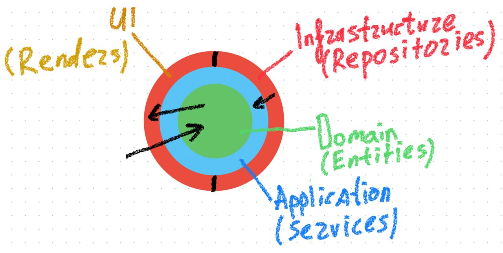

## Ретроспектива

Обычно, я учавствую в проектах, где уже есть какая либо архитектура. Это упрощает решение задачи, тк зачастую ненужно тратить время на проектирование.

В текущей задаче было несколько мыслей какую архитектуру выбрать. Если взять задачу в вакууме, то ее можно уместить в один файл, но это не тот подход, который нам нужен. Далее были мысли по поводу MVC, MVVM и DDD. Остановился на DDD. На первый взгляд может показаться, что код излишний для этой задачи, НО если смотреть на возможность масштабирования и обязательно появляющиеся новые требования от бизнеса, то это оптимальный выбор.

## Трудозатраты

- Составление первичного плана приложения (1ч)
- Webpack, prettier и тд (1ч)
- MVP (3 часа) (Возникли небольшие сложности с представлением приложения, поэтому решил набросать MVP, что бы прояснить картину)
- Проектирование (5ч)
- Написание кода (12ч)

## Сложности

- Нет возможности уточнить некоторые моменты (например у аналитика), например с выборкой случайных 6 слов. Я применил решение в лоб, которое не отличается производительностью, но если говорить о небольших размерах массива слов, то решение вполне приемлемо
- Размер тренировки и допустимое количество ошибок в слове откуда будем получать или как-то расчитывать? На всякий случай сделал эти параметры настраиваемы при инициализации приложения.
